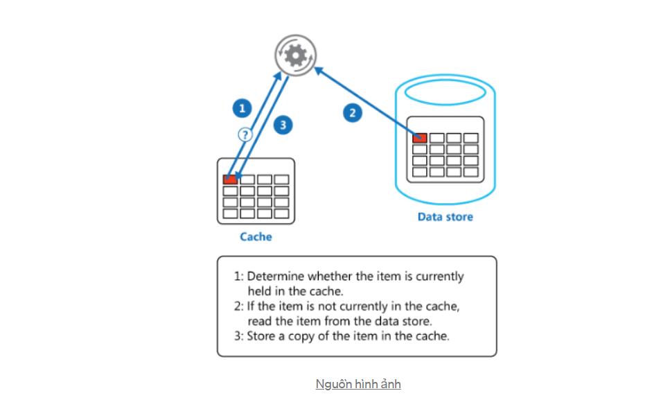

# Cache là gì ? 
Cache có thể là phần cứng hoặc phần mềm trong lưu trữ dữ liệu , Để phục vụ cho các request tương tự trong tương lai có thể được tái sử dụng giúp request nhanh hơn 
## Hình ảnh minh họa 

## Đến hiện tại Cache được chia làm 2 loại 
	- Loại 1 : Cache In Memory - Cache bằng bộ nhớ ( trên ram)
	- Loại 2 : Distributed Caching - Cache bằng hệ thống phân tán